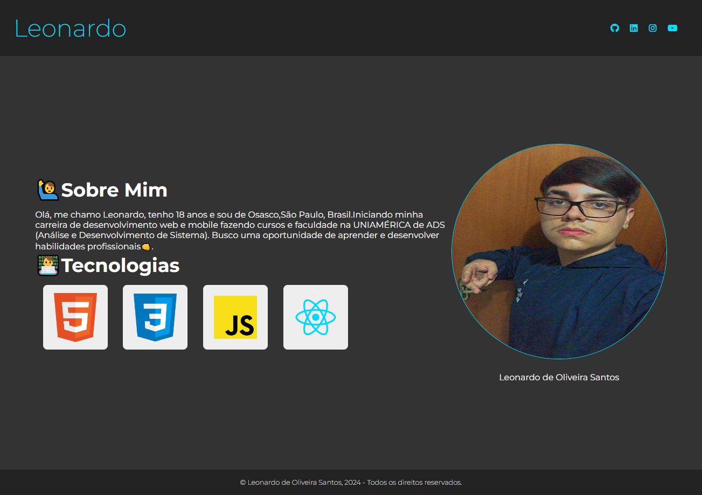

# Projeto Curso Udemy 

> Trilha Explorer

projeto construido no curso da Udemy sobre HTML5, CSS3 e Javascript.

[🔗 Clique aqui para acessar](https://leonardo21042006.github.io/projeto-curso-udemy/)

## 🛠️ Tecnologias 

- HTML
- CSS
- GIT
- GIT HUB

## 🔥 Contato

leonardosantosbr53@gmail.com